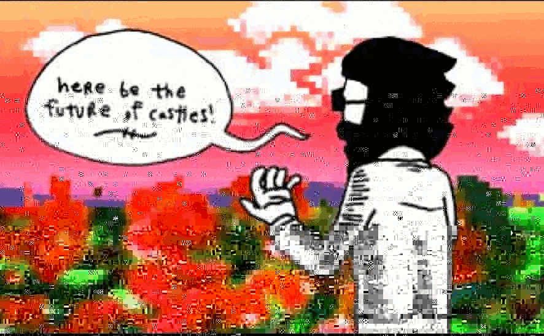

# ScrambledJpeg

Super simple jpeg glitcher.

[Here is a pretty good tutorial](http://www.docpop.org/2014/01/a-glitch-primer-editing-image-files-with-text-editors/) that covers the logic behind this and [this looks like a good list](http://phillipstearns.wordpress.com/glitch-art-resources/) of resources for other forms of glitch art.

### SCRAMBLE ALGORITHM

0. Reads a .jpg/.jpeg file
0. Writes first line of original to new file to preserve headers
0. Stores last line of original to preserve EOF
0. Writes GRANULARITY lines of original to new file
0. Caches GRANULARITY lines of original
0. Writes GRANULARITY lines of original to new file
0. Writes the cache to new file
0. ETC.
0. When it runs out of lines to write, it writes the last line and closes the new file.

## Installation

    $ gem install scrambled_jpeg

## CLI Usage

    # granularity defaults to 5.
    $ scrambled_jpeg [FILENAME] ([GRANULARITY])
    $ scrambled_jpeg example.jpg

    # numbers have differing effects depending on file size and stuff...sometimes it breaks the image...
    $ scrambled_jpeg example.jpg 50

## THE FUTURE

other potential glitch algorithms:

0. Benedict
0. Poach
0. HardBoil
0. Omelette
